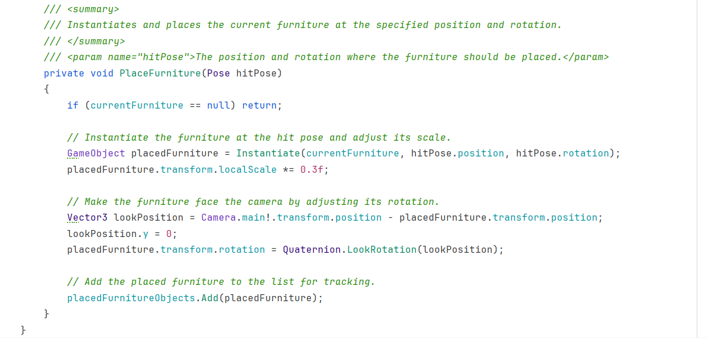

<b>Merging Branches and Furniture Placement Progress</b>

This week was a significant one for our XR Development project, as we successfully merged all our individual branches into the main branch. It was exciting to see all our work come together. However, with the merge, we encountered some issues, particularly on Android devices.

### Furniture Placement Feature

One of the primary features we’ve been developing is the Furniture Placement functionality. This feature allows users to place virtual furniture in their real-world environment using augmented reality (AR). Here’s how the feature works:

<b> Surface Detection </b>: The app detects flat surfaces through ARKit (for iOS) or ARCore (for Android), displaying visual indicators when surfaces are found.

<b> Furniture Placement </b>: Once a surface is detected, users can select furniture from the available list and place it on the surface by tapping the screen.

Here’s a snippet of the code we used for detecting surfaces and placing objects:

At this stage, users can only place the furniture. Additional interactions like moving, rotating, or resizing the placed items have not been implemented yet but are planned for future development.

#### Android Placement Issues

While the furniture placement feature works perfectly in the Unity simulation, we faced issues when testing on Android devices. On Android, furniture placement is less accurate, and there are occasional problems with detecting surfaces. It seems the difference in how ARKit (iOS) and ARCore (Android) handle AR functionality is affecting the app’s behavior on Android devices.

We are currently investigating these issues to ensure the furniture placement works smoothly across all platforms, with our next steps focusing on debugging and refining the Android-specific implementation.
